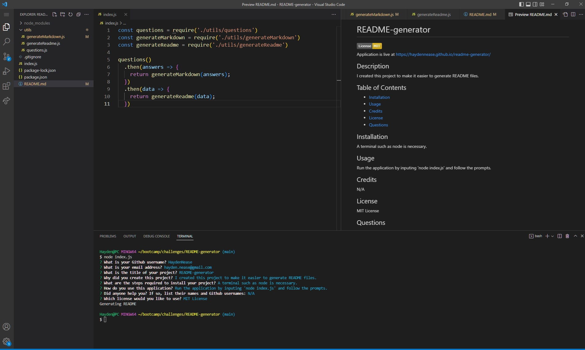

# README-generator
    
Application is live at https://haydennease.github.io/readme-generator/  
## Description
I created this project to make it easier to generate README files.
## Table of Contents
- [Installation](#installation)
- [Usage](#usage)
- [Credits](#credits)
- [License](#license)
- [Questions](#questions)

## Installation
A terminal such as node is necessary.

## Usage
Run the application by inputing 'node index.js' and follow the prompts.

## Credits
N/A

## License
MIT License

## Questions
Please send any questions about this application to hayden.nease@gmail.com or follow my work at https://github.com/HaydenNease/
